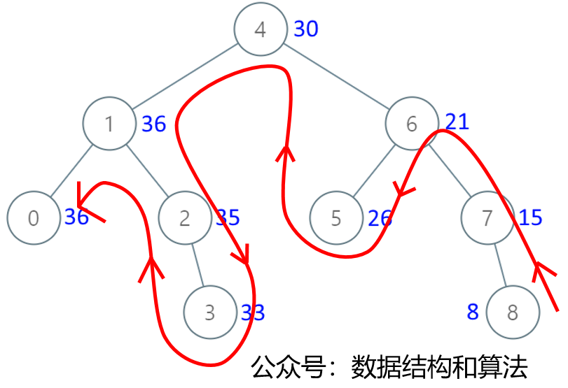

## [538. 把二叉搜索树转换为累加树](https://leetcode-cn.com/problems/convert-bst-to-greater-tree/)（中等）





```java
    int sum = 0;

    public TreeNode convertBST(TreeNode root) {
        // If the current node is empty, return directly
        if (root == null)
            return null;
        // Because the value of the current node is the current node
        // plus the value of its right child, we need to traverse
        // the right child first
        convertBST(root.right);
        // accumulate
        sum += root.val;
        root.val = sum;
        // Traverse the left subtree
        convertBST(root.left);
        return root;
    }
```


```java
    public TreeNode convertBST(TreeNode root) {
        TreeNode cur = root;
        Stack<TreeNode> stack = new Stack<>();
        int sum = 0;
        while (cur != null || !stack.isEmpty()) {
            //Push all right child nodes of
            // the current node onto the stack
            while (cur != null) {
                stack.push(cur);
                cur = cur.right;
            }

            cur = stack.pop();
            //accumulate
            sum += cur.val;
            cur.val = sum;
            // left child node
            cur = cur.left;
        }
        return root;
    }
```

